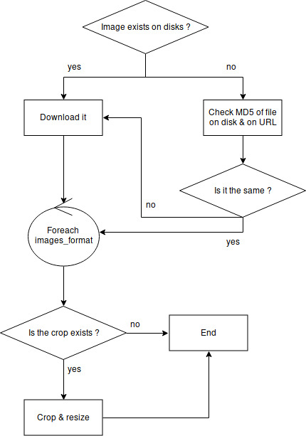

# worker_images
[](https://travis-ci.org/Youkoulayley/worker_images)
[](https://coveralls.io/github/Youkoulayley/worker_images?branch=master)

This project aims to manage the images of the Série-All website. But the project has been thinking with idea 
of being adapted to any other usages.
The worker images takes message from NATS, download the desired image, resize it and crop if necessary.

**Workflow of the worker** :



## NATS
A NATS streaming server is mandatory for the functioning of the worker_images.
The message send to the worker image need to have this format : 

```json
{
  "url": "https://www.thetvdb.com/banners/fanart/original/5b0fcf2c5c1b5.jpg", 
  "name": "supergirl", 
  "crop_type": "poster", 
  "crop": "middle",
  "force_crop": "false"
}
```

The message contains different section :

* **URL**: The URL where to download the image ;
* **Name**: The name of the image when saved to the disk ;
* **Crop_type**: The type to use (show config.ini for more informations) ;
* **Crop**: The alignment of the crop ;
* **Force_crop**: If true, force the resize & crop, even if the fil exists.

## config.ini
Example : 

```
[DEFAULT]
application_name = worker_images
images_folder = ../images
original_folder = %(images_folder)s/original
image_formats = {
    "poster": [
        "200_200",
        "300_300",
        "500_150"
        ],
    "banner": [
        "100_50"
    ]}

[LOGGING]
level = debug

[NATS]
cluster_id = serieall
channel = worker_images
```

The Default section contains the configuration for the application.

|Name|Description|Type|
|----|-----------|----|
|application_name|The name of the application, used for the logger or the connection to NATS|string|
|images_folder|Path of images folder|path|
|original_folder|Path of originals images|path|
|image_formats|A list of format to crop divided by type. Each type can have a different set of formats. You have to precise the type in the message sent to NATS|list|

The Logging section contains the configuration for the logger.

|Name|Description|Type|
|----|-----------|----|
|level|Log Level|debug/info/warning/error|

The NATS section contains the configuration to connect to NATS

|Name|Description|Type|
|----|-----------|----|
|cluster_id|The cluster of the NATS server|string|
|channel|Channel where the NATS messages are send|string|
